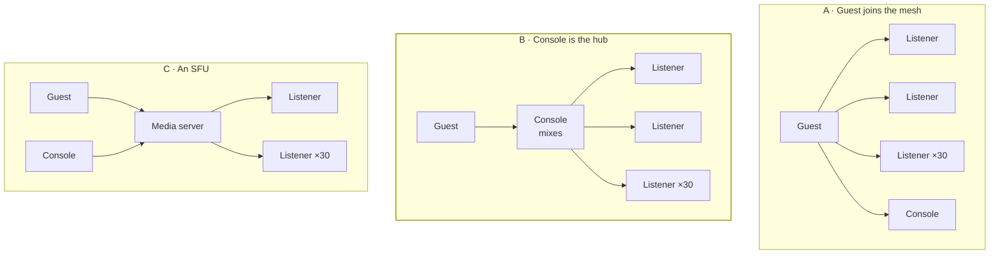
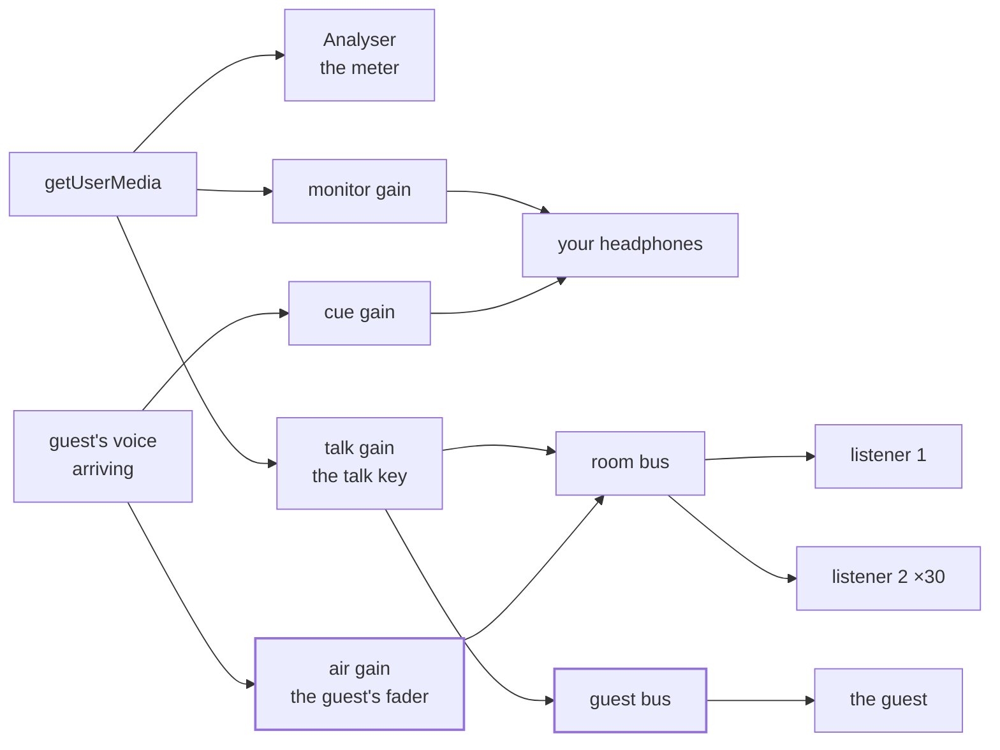
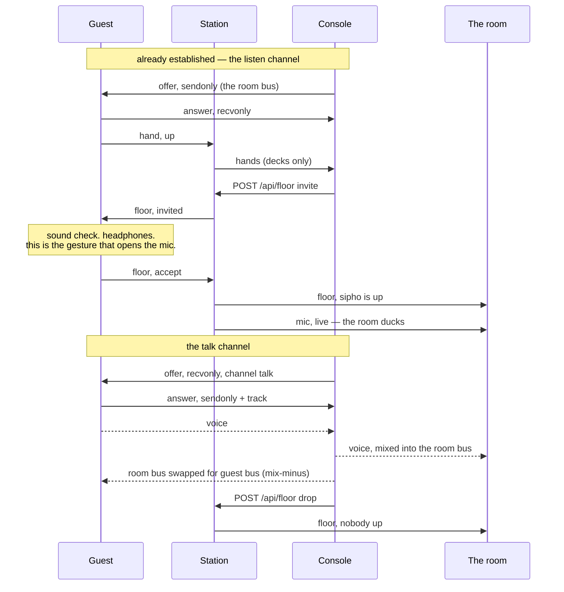

# Call-in: letting a listener talk back

[broadcasting.md](./broadcasting.md) ends with a list of things deferred on
purpose, and this is one of them: *listener call-ins. The mesh and the admin
gate both assume exactly one voice.* This is the document that un-defers it.

The short answer is that this is much closer than it looks — most of the parts
exist — and that the hard problem is not permission, not signalling, and not the
mesh. It is that **the guest must not hear themselves.** Everything below is
arranged around that.

## What "join" already means

Worth clearing up first, because the word is doing two jobs.

A listener can already *join*: they redeem an invite (`STATION_KEY`, the listener
cookie, `useStationAccess`), press the join button, type a nickname, and land on
the roster. That is built, it works, and none of it changes here. The door is not
the subject.

What they cannot do is **join the broadcast** — be heard by the room. Right now
the station is deliberately one-directional:

```ts
// server/src/protocol.ts
// - The decks may address any socket. That is what fanning a voice out is.
// - A listener may address the decks and nobody else.
```

```ts
// client/src/hooks/useVoice.ts, useVoiceBroadcast
// Answers and candidates only. An offer arriving here would be a listener
// trying to send the decks a microphone, which nothing in this station does
// and which the console has no business accepting.
```

That second comment is the exact line this feature crosses, and it is the only
one. The server's address book already permits a listener to reach the decks;
what does not exist is a reason for the console to listen.

## The problem, stated honestly

A voice going *out* is easy here because the station already solved fan-out: one
microphone, N peer connections, and a duck that lands on a clock thirty browsers
already share. A voice coming *back* is three problems stacked:

1. **The room has to hear it.** The guest's audio has to reach thirty browsers,
   and the guest is a stranger on a laptop, not a machine you control.
2. **The guest must not hear themselves.** Whatever path carries the guest's
   voice to the room must not also carry it back to the guest. Delayed sidetone
   at half a second makes speech physically difficult — it is the single most
   reliable way to make a call-in unusable, and it is the default outcome of the
   obvious implementation.
3. **Somebody has to be able to stop it.** An open microphone in a room of
   thirty is a moderation surface, and unlike chat it cannot be deleted after the
   fact.

## Three topologies



| | Guest's uplink | Console's load | Server cost | Moderation | Verdict |
|---|---|---|---|---|---|
| **A** — guest joins the mesh as a second broadcaster | 30 Opus encodes, ~1 Mbps up | unchanged | none | server must grow a second broadcaster permission | **No** |
| **B** — guest sends one stream to the console, which mixes it into what it already sends | 1 connection, ~48 kbps up | +1 decode, +1 mix | none | one place to cut | **Build this** |
| **C** — an SFU (LiveKit, mediasoup) | 1 connection | small | money and ops | good | later, and only on a trigger |

**A is the one that looks obvious and is wrong.** It makes every guest carry the
fan-out cost that broadcasting.md already identifies as the thing that breaks
first — thirty separate Opus encodes on their machine. Your console is a laptop
you chose; a guest is a five-year-old phone on hotel wifi. It also doubles the
mesh to ~60 peer connections at thirty listeners, and it requires the server to
learn a second class of broadcaster, which is real permission surface for a
feature that will be used by one person at a time.

**B costs the guest one connection** — the same as any listener already has —
and costs the room nothing at all, because the room's connections already exist.
It is also the topology every phone-in show has ever used: the caller is on a
line to the studio, and the studio is on the air. The metaphor the whole project
runs on happens to be the correct engineering answer.

The price of B is a second hop, and re-encoding. Both are quantified below.

## The design

### The console becomes a small mixer

The console's microphone rig already ends in a `MediaStreamAudioDestinationNode`
and hands the single track off it to every peer:

```ts
// client/src/hooks/useMicInput.ts
source.connect(analyser)
source.connect(monitor)
source.connect(talk)
talk.connect(outbound)          // ← what every listener is sent
monitor.connect(context.destination)
```

That destination node is a mix bus. It has always been a mix bus; it has just
never had more than one thing on it. Call-in is mostly the act of noticing that.



Two buses instead of one. The room bus carries you *and* the guest. The guest bus
carries you *only*.

### Mix-minus: the absence that makes it work

There is no arrow from `RX` to `guest bus`, and that missing arrow is the whole
feature. It is called mix-minus in a studio — you send each remote participant
the programme minus themselves — and it is the difference between a phone-in and
an unusable howl.

If you send the guest the room bus, they hear their own voice roughly 600 ms
after they said it. That is not a cosmetic problem: delayed auditory feedback at
that interval is used deliberately in speech research to disrupt fluency. They
will stop mid-sentence and assume the station is broken.

In this codebase it costs about ten lines: a second
`createMediaStreamDestination()`, fed by `talk` and nothing else, and one
`replaceTrack` on the guest's existing peer connection to swap them from the room
bus to the guest bus. `replaceTrack` does not renegotiate — both tracks are mono
audio off the same context — so a listener becomes a guest without a gap in what
they can hear.

Three separate faders fall out of this for free, and they are all things a
console should have had anyway:

- **cue** — the guest in your headphones only. Audition someone before the room
  hears a word. Real radio calls this pre-fade listen; here it is one node not
  being connected.
- **air** — the guest's level in the room. Ride it, or slam it to zero.
- **talk** — your own, unchanged.

### The talk channel, and why the decks still always offer

`webrtc.ts` is built on one load-bearing sentence:

> *Audio goes one way, the decks always offer, and a listener never does. That
> means none of the perfect-negotiation machinery applies, because there is no
> glare to resolve.*

Do not break it. Instead, when the console brings a guest up it opens a **second**
peer connection to that listener and offers it `recvonly` — "I would like to
receive". The guest answers `sendonly` and attaches their microphone. The decks
still offer, the listener still only ever answers, and there is still no glare,
because the guest cannot initiate anything.

Two connections between the console and the guest, each one-directional:



Both connections carry signalling from the same socket id, so the payload needs
one more field to say which connection it belongs to:

```ts
// client/src/lib/webrtc.ts
export type SignalPayload =
  | { kind: 'offer';  sdp: string;                  channel?: Channel }
  | { kind: 'answer'; sdp: string;                  channel?: Channel }
  | { kind: 'ice';    candidate: RTCIceCandidateInit; channel?: Channel }

/** Which of the two connections this belongs to. Absent means 'listen'. */
export type Channel = 'listen' | 'talk'
```

Optional, defaulting to `listen`, so nothing already on the wire changes meaning.
The server still does not read it — it does not read any of this — but both ends
now key their link maps by `(peer, channel)` instead of by peer alone. Without
this, an ICE candidate for the talk channel is indistinguishable from one for the
listen channel, and the connection that gets it will quietly discard it.

The one new function in `webrtc.ts`:

```ts
/** The console's end of the talk channel: offers recvonly, receives a voice. */
export function inviteVoice(options: ReceiveOptions): PeerLink
```

The guest's end is `offerVoice` — the function the console already uses — pointed
at a different track. Nothing else in that file changes.

### The floor: permission as a state machine

Modelled on `mic.ts`, which is the right precedent: in memory, one small object,
a snapshot on the wire, mutated by verbs.

```ts
// server/src/floor.ts

export interface FloorSnapshot {
  /** Who is on air besides the decks. Broadcast to everyone. */
  speaker: { id: number; nickname: string; since: number } | null
  /** Asked up, not yet answered. Broadcast, so the guest learns of it. */
  invited: { id: number; nickname: string; expiresAt: number } | null
}

export class Floor {
  raise(id: number, nickname: string): boolean   // listener, over the socket
  lower(id: number): boolean                     // listener changed their mind
  hands(): Listener[]                            // for the decks only
  invite(id: number): boolean                    // console, over HTTP
  accept(id: number): boolean                    // guest, over the socket
  drop(id: number): boolean                      // console, or the guest leaving
  leave(id: number): boolean                     // a socket closed
  sweep(): boolean                               // an invitation nobody answered
  clear(): void                                  // the session ended
}
```

Four deliberate choices.

**One speaker.** `speaker` is a single value, not a list. The mixer would take
several without complaint — one gain node each — but every additional open
microphone multiplies the feedback surface and the moderation load, and two
people talking over a 600 ms round trip is not a conversation. Ship one. The type
is the only thing that has to change to allow two, and by then you will know
whether you want it.

**Hands go to the decks, not to the room**, exactly like wishes. Raising a hand
in public is a small social cost paid by the shyest person in the room, and a
visible queue is something the room will nag you about. The *speaker* is public,
because a voice arriving from nowhere with no name attached is worse.

**No lease.** The mic needs one because the console renews over HTTP and the
station cannot see it die. Every floor state here is pinned to a socket the
server is already watching and already reaps on close, so `leave(id)` is enough.
The one exception is the invitation, which is waiting on a human and gets sixty
seconds — otherwise the console spends the evening showing a phantom *waiting for
sipho*.

**A muted nickname cannot raise a hand or be invited.** A mute already covers
chat and wishes for the reason that both are text signed with a nickname; a mute
that left the microphone open would just move where somebody was shouting.

### What goes on the wire

Down, to everyone:

```ts
export interface FloorMessage {
  type: 'floor'
  speaker: { id: number; nickname: string; since: number } | null
  invited: { id: number; nickname: string; expiresAt: number } | null
}
```

Down, to the decks only — the same shape `wished` uses, addressed rather than
broadcast:

```ts
export interface HandsMessage {
  type: 'hands'
  hands: Listener[]
}
```

Up, from a listener, over the socket alongside `say` and `wish` — because a
listener has no credentials and the socket is the only channel they have:

```ts
export interface HandClientMessage {
  type: 'hand'
  action: 'raise' | 'lower' | 'accept' | 'leave'
}
```

Up, from the console, over HTTP behind `requireAdmin` — because it is a command,
and commands go over HTTP:

```
POST /api/floor  { action: 'invite' | 'drop', listener: number }
GET  /api/floor  → FloorSnapshot        (open, like /api/mic)
```

The split is the one the codebase already draws and it lands cleanly: listeners
act over the socket, the console acts over HTTP, and only plumbing (SDP, ICE) is
exempt.

### The duck, and who opens the mic

The room ducks on the `mic` frame and nothing else. A guest talking must duck it
too, so:

- `floor.accept()` opens the mic server-side. The room is already ducked by the
  time the first word arrives, which is the same reason a listener joining
  mid-break is handed `mic` before `state`.
- The console renews the lease while **either** it is talking **or** a guest is
  up. One line in the existing renew timer.
- `floor.drop()` does *not* close the mic. You will nearly always say something
  after the guest — *thanks, sipho* — and un-ducking between their last word and
  your first is a swell of music in the middle of a sentence.

The console's own duck-depth control keeps working unchanged; it is a fader
position belonging to whoever runs the decks, and a guest does not get one.

### One structural change on the client

`useMicInput` currently couples two things: the microphone, and what goes out. A
guest-only segment — you bring somebody up and let them talk while you say
nothing — needs the second without the first, and today there is no outbound bus
at all until `getUserMedia` succeeds. Worse, `useVoiceBroadcast` only builds peer
connections when `track !== null`, so with no console microphone there is no
mesh for the guest's voice to travel down.

Extract a `useAirMixer` that owns the context, the two buses, the guest input and
the three faders. `useMicInput` keeps the capture, the meter, the device picker
and the monitor, and connects into the mixer. Then:

- the mesh is up whenever the console has anything to send — mic open **or** a
  guest up;
- you can bring a guest up without ever granting microphone permission;
- the mix-minus lives in one object with one reason to exist.

This is the largest single piece of work on the client side and it is worth doing
first, because everything else hangs off it.

## Feedback, which is worse for a guest than it is for you

broadcasting.md already warns about this for the console, and every word of it
applies harder to a guest: you are a person who read the warning, on headphones
you chose, on a machine you set up. A guest is whoever raised their hand.

**The caller hears the studio, not the record.** The strongest move available,
and it is one line: while a listener is up, their own music ducks to silence
locally — not to `duckTo`, all the way down. They hear you over the talk channel
and nothing else. This eliminates the entire acoustic-echo class of problem in
one stroke, because there is no music coming out of their speakers to be picked
up. It also happens to be exactly what being a caller on real radio sounds like,
which means it needs no explanation to the person it happens to. When they come
down, the music resumes — the position is a pure function of the station clock,
so there is nothing to resynchronise.

On iOS this stops being a choice: `getUserMedia` seizes the audio session and
will interrupt the `<audio>` element anyway. Better to do it deliberately on
every platform than to have it happen on one.

The rest, in order of how much it buys:

- **`echoCancellation: true` by default for guests**, the opposite of the console
  default. `micConstraints(deviceId, onSpeakers)` already flips the three
  constraints together; a guest simply starts on the "I'm on speakers" side of
  that switch. It mangles music, and a guest is not sending music.
- **A sound check that is a gate, not advice.** The guest cannot go up without
  passing it. Two checks, both cheap with the analyser that already exists:
  *speak and watch the meter move* (proves the right device is open), and *now be
  quiet for two seconds* (if the level is still up, something in their room is
  making noise into the mic, and they are told so before thirty people hear it).
- **Their own meter, large, while they are up.** The reason the console has one
  is that the only other way to know you are live is to hear yourself, and
  hearing yourself is the thing causing the problem. A guest needs this more.
- **An unmissable on-air state on their own screen**, and a mute button they can
  reach without hunting. Someone whose microphone is open in a room of thirty
  should never have to wonder whether it is.

## The thing you cannot have

Real radio has a profanity delay: the programme runs seven seconds behind, and a
dump button drops the last seven seconds and closes the gap.

You cannot have one. The music is aligned to a server clock and the voice is
live; delaying the voice by seven seconds would put every cue you give seven
seconds late over a record that did not wait. Delaying everything means delaying
the clock, and the clock is the project.

The honest substitute is an **instant cut**: one key on the console, always
bound, always reachable, that takes the guest's air gain to zero in a ramp too
short to hear and then closes the talk channel. It is client-side, so it costs no
round trip — the guest is off the room bus in the same frame you press it. It
cannot un-say the word. It can stop the second one, and that is the whole of what
is available.

Bind it to something you cannot hit by accident and cannot miss in a hurry, and
put a *stand down* button next to it that is polite rather than abrupt, so the
sharp one stays sharp.

## What this costs

**Latency.** Two hops instead of one.

| Path | Hops | Typical |
|---|---|---|
| You → the room | 1 | 300–500 ms |
| Guest → you | 1 | 300–500 ms |
| Guest → the room | 2 + mix | 600 ms–1 s |

The number that matters for conversation is the second row, and it is unchanged
from any voice call: you and the guest talk normally. What the room hears is the
two of you about 300 ms apart, which reads as a phone line, which is what it is.
Nobody will notice. Do not chase it.

**Re-encoding.** The guest's voice is decoded on your machine and encoded again
into every listener's stream. Opus twice at speech bitrates is a small, real
quality cost. The fix is nearly free: the guest → console leg is a *single*
connection, so give it 48–64 kbps instead of the 32 kbps `VOICE_BITRATE` used for
fan-out. Better input to the re-encode, and the bandwidth is one listener's worth.

**Your machine.** One extra decode and a handful of gain nodes. Against thirty
Opus encodes already running, this is nothing. The console remains the ceiling
for the same reason it was before.

**The station.** Still zero audio. Still a few hundred bytes a second. The
defining property of the project survives this feature intact, which is the main
argument for building it this way.

**Code.** Roughly 250 lines of server with its tests, 500–600 of client. A new
category of failure — a stranger's microphone — and a new class of support
question you cannot reproduce.

## How each failure ends

| What happens | What the station does | What anybody sees |
|---|---|---|
| Guest's tab closes | socket closes → `leave` → floor cleared, broadcast | speaker disappears; music comes back up when you close the mic |
| Guest never answers the invitation | `sweep` after 60 s | *sipho didn't come up* on the console; nothing in the room |
| Guest's talk channel fails ICE | same retry ladder as the listen channel, then `unreachable` | console says they cannot be reached; you drop them |
| Guest is a howling speakerphone | you hit the instant cut | one bad second, not an evening |
| Your tab dies mid-call | mic lease lapses; `onDecksGone` clears the floor | room un-ducks; guest's voice was going through you, so it stops with you |
| Guest raises a hand while muted | refused with `muted`, like a chat message | *the decks have muted you* |
| Two listeners invited at once | `invite` refuses while `speaker` or `invited` is set | console says somebody is already up |
| Guest goes up while off air | refused, like `mic open` off air | nothing to talk over |

The middle row is worth sitting with: **under this topology the guest's audio
depends on your browser staying alive.** That is already true of your own voice,
so it adds no new single point of failure — but it does mean a console crash
takes two people off the air instead of one.

## Build order

Same philosophy as M1 in broadcasting.md: put the whole user experience in front
of the risky part, and ship the un-risky half on its own.

1. **The floor, with no audio at all.** `Floor`, the frames, the routes, the
   hand-raise button, the hands list on the console, bring-up and stand-down, the
   on-air lamp naming the guest, and the room ducking for a guest who cannot yet
   say anything. Test it by having somebody raise a hand while you talk to them on
   the phone. You will learn whether the invitation flow feels right — how long
   sixty seconds is, whether hands should be private — while there is nothing else
   to blame.
2. **Extract `useAirMixer`.** No new behaviour. The room bus and the guest bus
   both exist, both carry the same thing, and the mesh comes up without a
   microphone. Everything keeps working exactly as it does today, which is what
   makes this the easy one to verify.
3. **The guest's sound check.** `useMicInput` on a listener's page, the meter,
   the quiet-room check, the headphones gate, the local music ducking to silence.
   Still nothing transmitted. Still shippable.
4. **The talk channel, to your headphones only.** `inviteVoice`, the `channel`
   tag, the cue fader. You can hear the guest; the room cannot. This is the risky
   milestone and it is worth doing alone, the way the sync spike was — and it is
   independently useful, because auditioning a caller before airing them is a real
   thing a station does.
5. **Mix-minus, and on air.** The guest bus, the `replaceTrack` swap, the air
   fader, the instant cut. The moment this works, verify by ear that the guest
   hears no trace of themselves — and then verify it in a test, because a
   mix-minus that regresses is silent on the console and unusable for the guest.
6. **Make it survivable.** Every row of the failure table, plus reconnects on both
   channels, plus what a listener who joins mid-call sees.

The milestone-by-milestone version of this — frames, signatures, file by file —
is in [call-in-build.md](./call-in-build.md).

## Files this touches

New:

```
server/src/floor.ts             the floor state machine, modelled on mic.ts
server/src/routes/floor.ts      invite / drop, behind requireAdmin
client/src/hooks/useAirMixer.ts the room bus, the guest bus, the three faders
client/src/hooks/useFloor.ts    listener side: hand, invitation, accept, leave
client/src/hooks/useGuestVoice.ts the guest's uplink and its sound check
client/src/CallIn.tsx           the guest's panel: meter, on-air, mute, leave
client/scripts/qa-callin.ts     three real browsers, one of them a caller
```

Changed:

```
server/src/protocol.ts     FloorMessage, HandsMessage out; HandClientMessage in
server/src/realtime.ts     hand handling; floor broadcast; clear on decks gone
server/src/app.ts          register the floor routes; sweep the floor beside the mic
client/src/lib/webrtc.ts   the `channel` tag; inviteVoice
client/src/hooks/useVoice.ts   per-channel link maps; per-peer track; accept an
                               offer only from whoever holds the floor
client/src/hooks/useMicInput.ts  capture only; the buses move to useAirMixer
client/src/AdminPanel.tsx  hands, bring up, cue and air faders, the instant cut
client/src/App.tsx         the hand button, the invitation, the guest panel,
                           and ducking your own music to silence while up
```

## Tests

The existing shape holds: unit tests against the fake `RTCPeerConnection` and
fake `AudioContext` pin the negotiation, and one Playwright script makes the
claim no unit test can.

- `server/test/floor.test.ts` — the state machine: every transition, the
  invitation expiry, a mute blocking a hand, a socket closing at each state.
- `client/test/mixer.test.ts` — **the room bus contains the guest and the guest
  bus does not.** This is the regression test that matters most in the whole
  feature, because the bug it catches is inaudible to the only person who can see
  the console.
- `client/test/webrtc.test.ts` — extended: a candidate tagged `talk` reaches the
  talk link and not the listen link.
- `client/test/protocol.test.ts` — the new frames, and an offer on the talk
  channel from someone without the floor being ignored.
- `client/scripts/qa-callin.ts` — three Chrome pages with fake devices, following
  `qa-voice.ts`: console, guest, plain listener. Two separately observable
  assertions, which is what that script is built for — **the listener hears the
  guest**, and **the guest does not hear the guest.**

## Belt and braces on the gate

The console decides which offers it accepts, because it knows who holds the
floor. The server can back that up for almost nothing: it already peeks at
`kindOf(payload)` to decide a log level, so it can refuse to relay a payload
whose `kind` is `offer` from a listener who does not hold the floor — without
ever parsing SDP, and without acquiring an opinion about WebRTC versions it
cannot keep current.

Two independent refusals for the one thing that would actually be bad here: a
listener pushing audio into the room without being asked.

## Deferred, deliberately

- **More than one guest at a time.** The mixer takes it; the room does not.
  Revisit when a single caller has been boring for a month.
- **Recording the call.** Same answer as recording a mic break: the station does
  not record, and a call is the one thing on it that a person did not consent to
  being kept.
- **An SFU.** The trigger is specific: more than one simultaneous guest, or more
  than about thirty listeners, or your uplink saturating. LiveKit's free tier
  would take the fan-out and the mix-minus off your machine and cost a layer, not
  a rewrite. Until one of those three is true, an SFU is a server you pay for so
  that a laptop can do less work than it is comfortably doing.
- **Guests who are not on the roster.** A phone number, a link that skips the
  door. Both are a different feature about access, not about voice.
