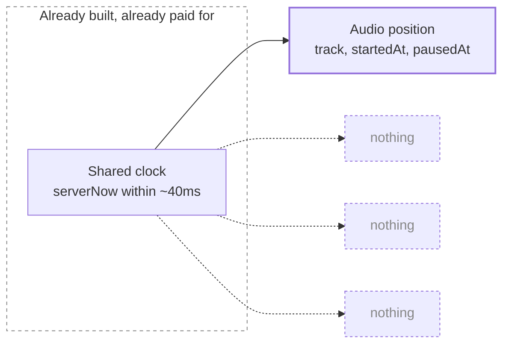
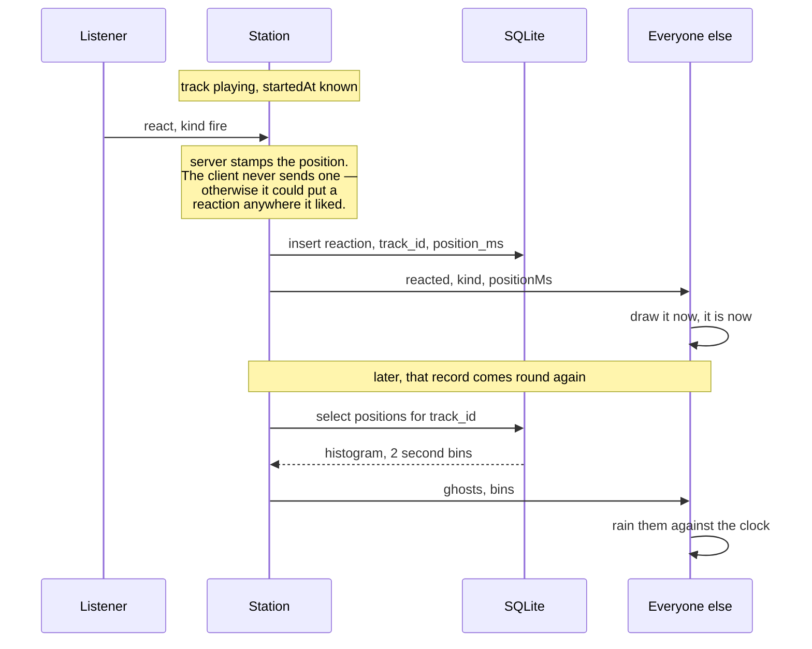
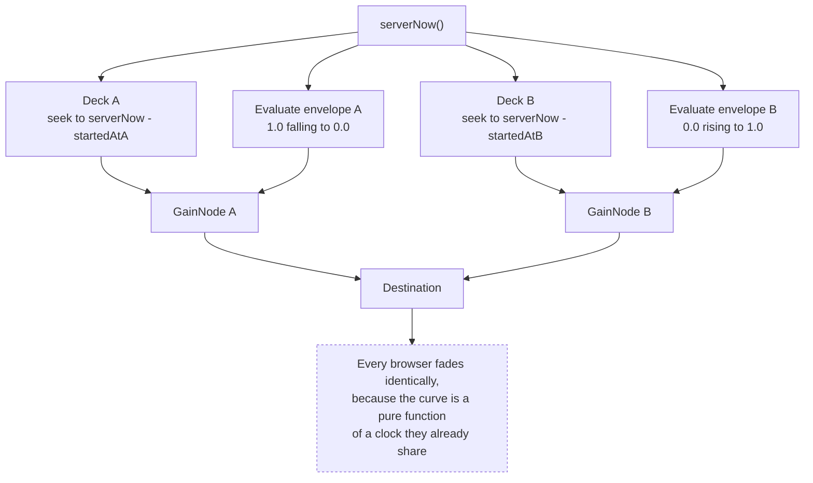
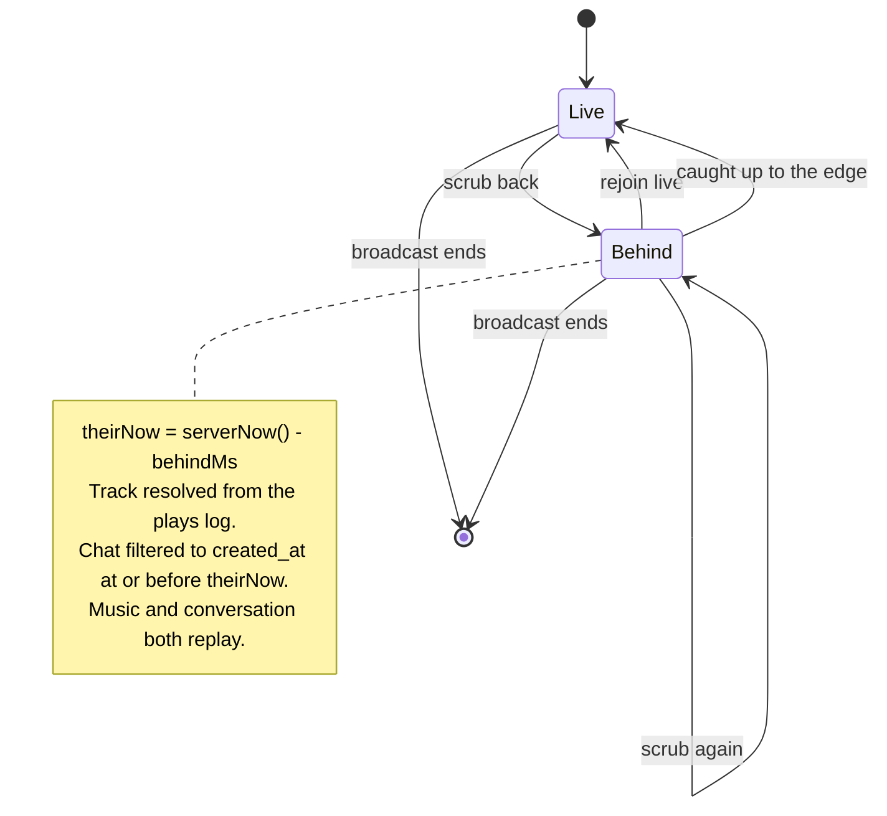
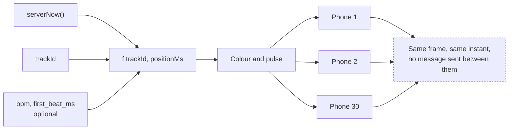
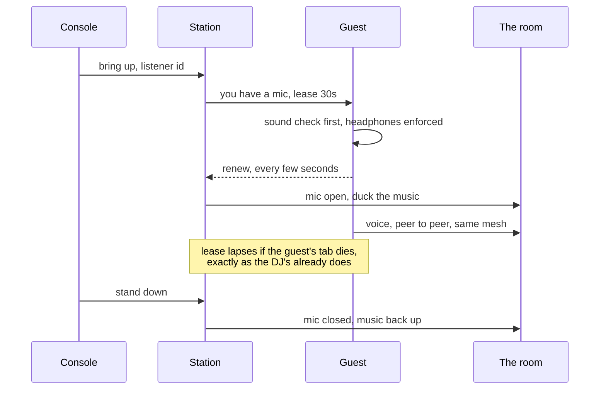
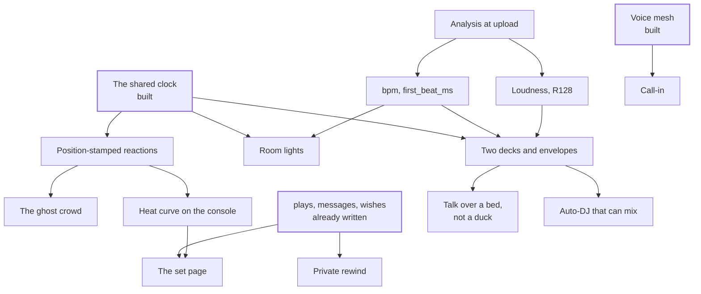

# What else the clock can carry

Ideas for where chunky.fm goes next, and how each one would actually work.
Opinionated on purpose: this is a proposal, not a menu.

---

## The thesis

The station has one asset nobody building a music app usually has, and it was
bought with the hardest work in the repo: **around thirty browsers agree on what
time it is, to within a few tens of milliseconds, continuously.** The NTP-style
handshake, the lowest-RTT sample, the re-run every thirty seconds, the drift
correction that nudges `playbackRate` instead of seeking — all of that exists
and all of it is paid for.

And it currently carries exactly one thing: the position of an audio element.



Everything worth building next is the same move: **put a second payload on the
wire that is already running.** A reaction, a colour, a light, a fade curve — if
it is a pure function of `(serverNow, what is playing)`, then it is free to
synchronise, because the synchronising is done.

That reframe is what separates the ideas below from a list of features any
music app could have.

---

## Tier one — the three I would build

### 1. The ghost crowd

**What it is.** Reactions, but stamped with the *position in the track* rather
than the wall clock, and kept. Every time a record plays, the room's reactions
are written against the song. The next time it plays, last month's crowd comes
back with it — anonymous, aggregate, raining down at exactly the bar where it
happened.

**Why it is not a gimmick.** PLAN.md defers "floating emoji reactions" as the
cheapest way to add life later. Live-only, that is true and it is also
disposable. Position-stamped and persisted, it becomes something else: the
record accumulates an audience. A track that has been played nine times arrives
already carrying nine nights' worth of people going off at 2:41. That is not a
feature other stations have, and it costs one table.

It also answers the only question the console currently cannot: *did that
land?* The heat curve under the scrub bar is the same data drawn sideways.

**How it works.**



New table, mirroring the shape `plays` already has:

```sql
CREATE TABLE reactions (
  id          INTEGER PRIMARY KEY AUTOINCREMENT,
  session_id  INTEGER NOT NULL REFERENCES sessions(id),
  track_id    INTEGER NOT NULL,   -- not a FK, same reasoning as plays
  kind        TEXT    NOT NULL,
  position_ms INTEGER NOT NULL,   -- into the track, not since the epoch
  created_at  INTEGER NOT NULL
);
```

Two message types: `react` up, `reacted` down, plus a `ghosts` payload folded
into the existing state broadcast when a track starts.

**The design calls that matter.**

- **The server stamps the position, not the client.** A client-supplied
  `positionMs` is a client that can decorate the chorus of a song it is not
  even listening to.
- **Ghosts are anonymous and binned.** "sipho reacted here three weeks ago" is
  surveillance; "eleven people reacted here" is a crowd. Bin at two seconds and
  drop the nicknames on the way into the histogram.
- **Live reactions keep their names, ghosts never do.** Different objects.

**What it costs.** One table, two protocol messages, one canvas overlay, one
curve under the admin scrub bar. Small. Days, not weeks.

**What could go wrong.** With five people in the room this is nothing — a
handful of marks per track. It only sings once the archive is thick, which
means it is a feature that gets better for a year and is unimpressive on day
one. Ship it early *because* of that, not despite it.

---

### 2. Two decks

**What it is.** The playback state stops being one tuple and becomes a short
list of them, each with a gain envelope on the shared clock. That single change
turns the station from a player into a mixer: real crossfades, beatmatched
transitions, a talk-over bed under the mic — none of it streamed, none of it
mixed on the server.

**Why it is the biggest idea here.** Right now the station is a very good
jukebox. Every track lands on the previous one's silence. The thing that makes a
set a set — the join between two records — is the one thing the architecture
cannot express. And it can, almost for free, because *a crossfade is just two
tuples and two curves, and every browser can evaluate curves against a clock
they already agree on.*

**How it works.** State goes from:

```ts
{ track, startedAt, pausedAt }
```

to:

```ts
{
  decks: [
    { id: 'a', track, startedAt, pausedAt, gain: Envelope },
    { id: 'b', track, startedAt, pausedAt, gain: Envelope },
  ]
}

// Breakpoints on the *server* clock. Position is already resolved this way;
// so is loudness now.
type Envelope = { atMs: number; gain: number }[]
```



Beatmatching needs two more columns on `tracks`, both computed once at upload:

```sql
ALTER TABLE tracks ADD COLUMN bpm REAL;             -- null when undetected
ALTER TABLE tracks ADD COLUMN first_beat_ms INTEGER; -- the downbeat grid origin
```

With those, the server picks deck B's `startedAt` so B's beat grid lands on A's
at the moment the fade begins. The client does nothing clever; it seeks where it
is told, as it already does.

**The honest problems, which are the interesting part.**

- **`playbackRate` is already spoken for.** Drift correction owns it — that is
  the whole trick from PLAN.md. Tempo-matching cannot also own it. The fix is
  that they compose rather than compete: `rate = tempoRatio * driftNudge`, with
  drift correction operating on the ratio-adjusted expected position instead of
  the raw one. This is the single subtle bit of work in the whole proposal and
  it should be built and tested on its own, the way the sync spike was.
- **Deck B has to be buffered before the fade, not at it.** Needs a `cue`
  message ~30s ahead so clients can preload and pre-seek. That is also
  independently useful: it is what would kill the "tuning in…" gap at every
  track change.
- **Two streams during the overlap.** Double bandwidth for eight seconds, thirty
  listeners. Irrelevant at this scale, worth writing down anyway.
- **BPM detection is wrong sometimes,** usually by a factor of two, and always
  on anything with rubato. So: detect it, show it in the library, let it be
  edited by hand, and never let a wrong number cause a bad transition silently —
  if `bpm` is null, fall back to a plain crossfade.

**What it unlocks afterwards.** The mic gets a bed to talk over instead of a
duck. The auto-DJ below becomes a thing that can actually mix. The room lights
get a beat grid.

---

### 3. The tail

**What it is.** Two halves of one idea: the station stops being purely
ephemeral.

**(a) The set page.** When a broadcast ends, it becomes a permalink. Tracklist
with times, the chat as it happened, the wishes, the poster, and — if the ghost
crowd exists — the heat curve of the night. A radio show becomes something you
can send someone on Tuesday.

The remarkable thing is that **this needs no new data at all.** `sessions`,
`plays`, `messages`, `wishes` and the poster are all already written and all
already carry timestamps. The set page is a query and a template. It is the
highest ratio of value to work anywhere in this document.

**(b) The private rewind.** A listener who arrives at 22:40 can scrub back
through the evening on their own, while the station carries on without them,
and snap back to live whenever they like.

This is nearly free for a reason worth appreciating: **resolving what is playing
is already a pure function of a timestamp.** `expectedPositionSeconds(state,
serverNow())` does not care whose "now" it is given. Rewinding is passing a
different number.



**The limitation, said out loud.** The mic does not rewind. The voice travels
peer-to-peer and only exists while it is being spoken, so a listener twelve
minutes behind gets the music and the room and not the DJ. The interface should
say so plainly — *"you're 12 minutes behind. The mic is live only."* — rather
than let someone quietly miss the best thing in the broadcast.

---

## Tier two — cheaper, and two of them punch above their weight

### 4. The room lights

Full-screen, no chrome, a colour field driven entirely by
`f(trackId, positionMs)`. Deterministic, therefore identical on every screen in
the room at the same instant, with **no new protocol whatsoever.** With a beat
grid it pulses on the beat.



This is the cheapest thing in this document and it may be the most memorable.
Thirty phones held up in one room, flashing in unison, over the internet, with
no light-show server anywhere — that is the demo that explains what the project
*is* to someone who would otherwise shrug at "it's synchronised".

**Safety, non-negotiable.** Cap the flash rate well under 3 Hz, honour
`prefers-reduced-motion`, and make the mode opt-in with a plain warning.
Photosensitive epilepsy is a real risk and a strobe is a real strobe.

### 5. Call-in

Invert the voice mesh. The admin picks somebody off the roster and brings them
up; their microphone joins the same mesh the DJ's uses; the room hears them.
A phone-in show.



Almost all of this exists: `useVoice`, the reach health list, the mic lease with
its renew-or-lapse rule, the duck that lands on the room's shared clock, the
sound check with its "I'm on speakers" constraints switch. What is missing is
permission — the server currently signals a broadcaster only to the decks.

**The failure to design against** is a guest on laptop speakers feeding the
room back to itself. The existing headphone warning and echo-cancellation
switch are the answer; make passing a sound check a precondition of going up,
not advice offered afterwards.

At thirty listeners with two broadcasters the mesh is around sixty peer
connections. Fine, but it is the ceiling — a third simultaneous voice wants an
SFU, and an SFU is a server that costs money, which is a different project.

### 6. The producer

A small panel that watches signals the station already computes and says
something when they go wrong. Real radio has a person for this; a solo DJ has
nobody.

| It notices | From what it already has | It says |
|---|---|---|
| Mic open, meter at the floor for 5s | `useMicInput` level | "Your mic is open but silent — muted at the hardware?" |
| Clipping | the `data-clip` the meter already sets | "You're clipping. Come off the mic a little." |
| Queue empty, under 60s left | queue length, `durationMs`, position | "Dead air in 48 seconds." |
| Every peer unhealthy while on mic | `reach.ts`, which already grades this | "Nobody can hear you. The music ducked anyway." |
| Roster halved inside a minute | presence | "Nine people just dropped. Check the socket." |

Cheap, mostly wiring, and it is the difference between noticing a problem and
noticing it twenty minutes later.

---

## Tier three — the ones I would only build after the above

### 7. The globe, live

The landing page already renders country outlines. Colour them by who is
actually listening, and pulse a country when somebody there reacts. Cloudflare
hands you `cf-ipcountry` for free.

Keep the country **in memory only, never in the database** — a roster is
ephemeral by design and a table of where your friends were on a Thursday is not
something this project should own.

Honest: on a thirty-person station this is three dots. It is for the feeling,
and the feeling is worth something, but it is not worth doing before the tail.

### 8. An auto-DJ that shows its working

When the queue empties, rather than silence: pick something by a rule the admin
chose — nearest BPM, same artist different record, "nothing played in 30 days",
"something wished for and never answered" — and **say why on the console**, with
an override sitting next to it.

The "why" is the entire feature. A black-box shuffle on a station whose whole
premise is one person's taste is worse than the silence it replaces. A line that
reads *"Cissy Strut, because it's within 2 BPM of what's ending and hasn't been
on since June"* is a suggestion from an assistant. Same code, different object.

### 9. Guest decks

A time-boxed, reduced-scope admin lease: someone else runs the station between
22:00 and 23:00. A second signed cookie with an expiry and a smaller set of
permissions — no *End broadcast*, no deletions, no invite minting.

This is how you get the variety of multiple rooms without multiple rooms, which
PLAN.md rules out for good reasons that still hold. One station, one permanent
link; the person behind it changes.

---

## The unglamorous one that beats most of the above

**Loudness normalisation, properly.** PLAN.md already names this as a known
wart, and `tracks.gain_db` already exists with a default of 0 waiting for
somebody to fill it in by ear.

Don't fill it in by ear. Measure EBU R128 integrated loudness once at upload,
store the offset that brings the track to a target around −14 LUFS, and apply it
on the gain node that the two-deck work puts there anyway.

It is not experimental and it will not make anybody say "how did you do that".
It is also, per hour of work, the largest jump in how good the station *sounds*
that is available anywhere in this list — because right now every mixed-source
upload arrives at a different volume and every one of those is a small moment of
somebody reaching for their volume key instead of listening.

---

## What I would not build

- **Multiple rooms.** It divides thirty people into rooms of four. The
  scarcity is the product.
- **Accounts.** A nickname in localStorage is not a limitation you have not got
  round to fixing; it is the reason arriving takes four seconds.
- **Listener uploads.** One person's taste is what makes this a station rather
  than a shared folder.
- **Recommendations, learned.** You have thirty listeners and you know all of
  them. A rule you wrote will beat a model you cannot explain, and the auto-DJ
  above is that rule.
- **A native app.** `useMediaSession` already puts it on the lock screen.

---

## What depends on what

The dependency graph, which is the real argument for the order:



## The order I would actually go in

| # | Thing | Why here | Rough size |
|---|---|---|---|
| 1 | Loudness at upload | Column exists; biggest sound-quality gain per hour; nothing depends on it, so it never blocks | Small |
| 2 | The set page | Pure query over data already written. Highest value-to-work ratio in the doc | Small |
| 3 | Position-stamped reactions + ghost crowd | Cheap, and it needs to start collecting *now* to be good in six months | Small |
| 4 | Room lights | Nearly free, and it is the thing that explains the project to outsiders | Tiny |
| 5 | The producer | Wiring over signals that already exist; protects every broadcast after it | Small |
| 6 | Analysis at upload → BPM | Prerequisite, and useful on its own in the library | Medium |
| 7 | Two decks + envelopes | The big one. Build the rate-composition spike first and alone, the way M1 was built | Large |
| 8 | Private rewind | Wants the tail's plumbing and a clear story about the mic | Medium |
| 9 | Call-in | Permission work over an existing mesh, plus real feedback-safety design | Medium |
| 10 | Auto-DJ, guest decks, live globe | Genuinely optional. Good after everything above, pointless before it | Varies |

---

## If you only take one thing from this

Build **two decks**. Everything else here is a good idea; that one changes what
the station *is*. A jukebox plays records one after another and a station joins
them together, and the join is the entire craft. The architecture can already
express it — it just needs the tuple to become a list.

And the reason it can is the same reason all of this is possible: the hard part
was done first, on purpose, before anything was built on top of it.
